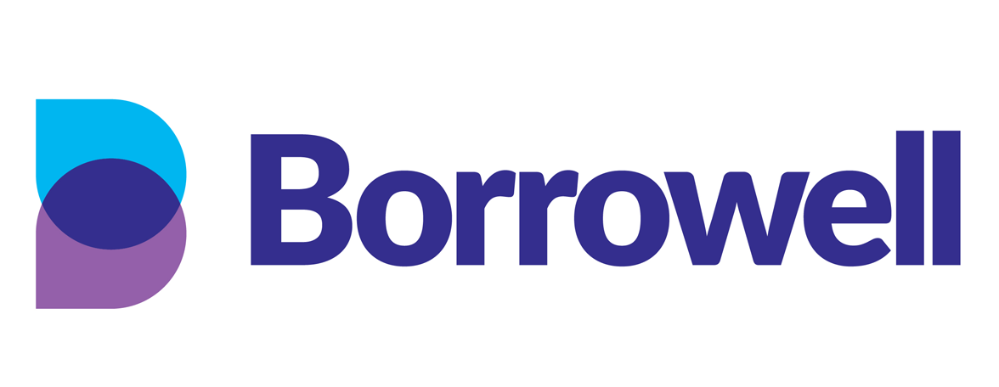

# Borrowell Case Study

## Purpose
Borrowell is a Canadian FinTech company. Their aim is to improve the credit score and financial health of Canadians!  Their mission is to make financial prosperity possible for everyone, according to CEO and Co-Founder Andrew Graham. 

Founded in 2014 Borrowell is one of Canada's largest fin-tech companies serving over 1 million people. They are partnered with some of Canada's biggest and most popular financial institutions, including CIBC, Scotiabank, Capital One and more.

## Offerings
Borrowell offers it's customers free credit scores, secured cards, credit building loans, and personalized tips for financial success. They achieve this by using a combination of an AI powered credit coach and recommendation engine that makes recommendations based on your unique profile. Borrowell is leading the way as the first Canadian Company to use an AI powered credit coach. Borrowell makes money buy recommending finacial products to it's customers. When a customer uses the recommended service or product, Borowell receives a commission payment as a fee for finding and enabling the sale. 

## Competitors
Credit Karma is considered the main competitor in this particular FinTech domain. Both companies offer simialr services with the main difference being that Credit Karma uses Transunion to source credit scores for it's customers, whereas Borrowell uses Equifax. According to crunchbase Credit Karma uses about 25% more technical products and services than Borrowell. 

## Recommendation

Our recommendation is to add more services to the platform. Credit Karma reported a revenue of $865 million in 2021 compared to Borrowell's $16.9 million. 

# Authors
Jay Davis - jaytothedavis@gmail.com

Adrian Au - adrian.lang.au@gmail.com

 

